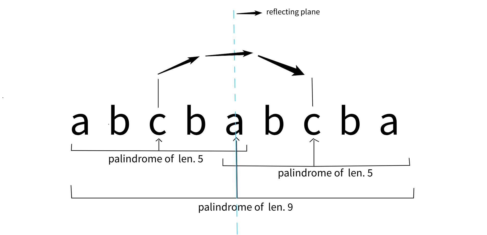
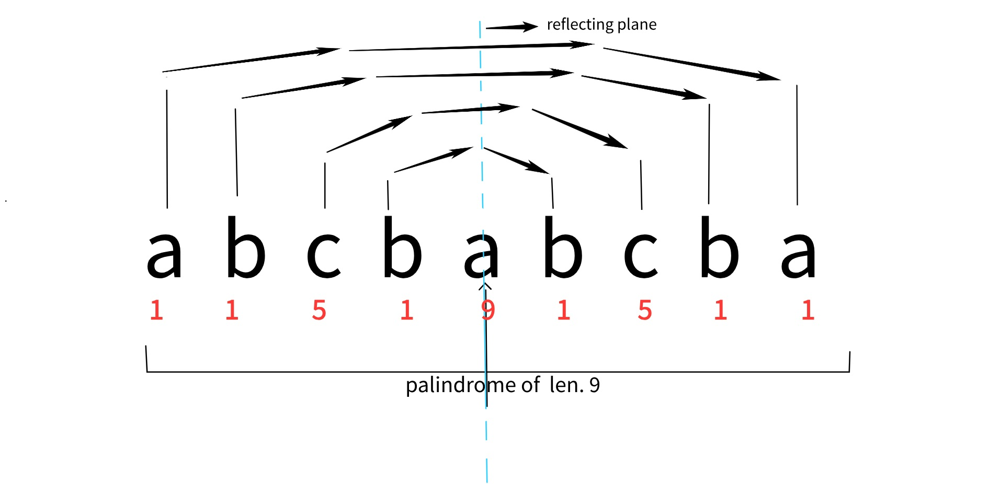
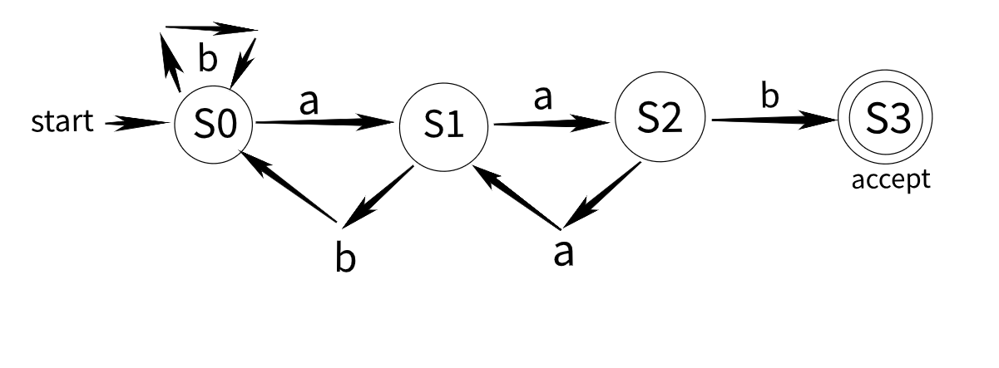
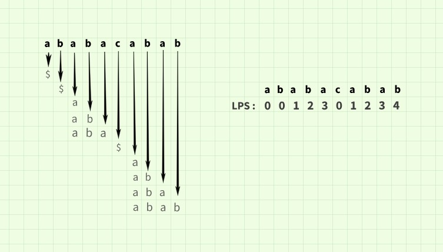

# Algorithms

|INDEX|
| -------- | 
|[1. Manacher's algorithm](https://github.com/d2ep4k/Algorithms/blob/main/README.md#1-manachers-algorithm)|
|[2. Mo's algorithm](https://github.com/d2ep4k/Algorithms/tree/main#2-mos-algorithm)|
|[3. KMP algorithm](https://github.com/d2ep4k/Algorithms/tree/main#3-kmp-algorithm)|
|[4. Boyer Moore majority vote algorithm](https://github.com/d2ep4k/Algorithms/tree/main#4-boyer-moore-majority-vote-algorithm)|
|[5. AHU encoding algorithm](https://github.com/d2ep4k/Algorithms/tree/main#5-ahu-encoding-algorithm)|

## 1. Manacher's algorithm  
> **Manacher’s algorithm** is used to find the longest palindromic substring in a given string in linear time and was discovered by Glenn K. Manacher in 1975.

#### ALGORITHM :

- Preprocess the input text by adding special characters (such as "*") between each pair of characters in order to simplify the procedure. The above method allows us to deal with even and odd-length palindromes in the same way.

     *For example, string "abcba" becomes "\*a\*b\*c\*b\*a\*"*
  
- Create a list that has the same length as the modified string, with each entry representing the radius of the palindrome that has index i in the center. Additionally, in order to construct a bounding box or window for the longest local palindrome lately observed, we keep track of the bounding box with the use of two variables, 'mid' and 'right', which stand for the middle and rightmost boundary of the detected rightmost palindrome, respectively.

- Now loop over the altered string's position  by position. For each position, we determine the palindrome radius at that position using the following rules:
  1. We can use symmetry to compute  palindrome radius located within the bounding box. The radius at index  *(say 'i')* is equal to the radius at **((2*mid) - i)** if the mirrored point **((2*mid) - i)** is inside the known palindrome's perimeter. Otherwise, the rightmost border **(right - i)** restricts palindrome radius
  2. If i is outside the rightmost boundary 'right', we start a new palindrome centered at i and set palindrome radius at index i to 0.

*PALINDROMIC PROPERTY*
    
    
- We maintain track of the rightmost palindrome boundary 'right' discovered thus far while updating the palindrome centers and radii. If a palindrome is found that goes beyond the existing 'right','mid' and 'right' are updated appropriately.

- To determine the largest palindrome radius, we visit the auxilary array. The characters centered at the place with the largest radius can be retrieved to yield the longest palindrome substring.

*PALINDROME MIRRORING*
    
  
[reference | cp-algorithms.com](https://cp-algorithms.com/string/manacher.html)
 
[cpp code](https://github.com/d2ep4k/Algorithms/blob/main/Manacher's%20Algorithm(Palindrome).cpp)
 

---

## 2. Mo's algorithm

---

## 3. KMP algorithm

> The **Knuth-Morris-Pratt algorithm**, also known as the KMP algorithm, is a string-searching algorithm that looks for instances of a "word" within a primary "text string" by making use of the observation that, in the event of a mismatch, the word itself contains enough information to determine where the next match could begin, avoiding the need to look again at previously matched characters, the time complexity of the overall algorithm is O(n + k), here n is length of "text string" and k is length of "word".

#### ALGORITHM :
The algorithm is similar to Automata theory, finite state automata pattern searching. The algorithm consists of two subroutines :
- pi funtion => calculates the LPS list for the word string.
- string matching => makes use of 2-pointer algorithm to match/parse word string.

FSM pattern matching: 

> *DFA Graphical Representation*
> - *States are represented by the vertices*
> - *The transitions are displayed in the arcs with input alphabet labels*
> - *An empty single incoming arc indicates the beginning condition*
> - *Double circles denote the ultimate state*

The DFA mentioned above may be used to find the word "aab" in any text string comprised only of a's and b's. The idea is to move between different final and non-final states as the input is read character by character. Depending on the character encountered, different transitions are present, and the current state is stored in a variable. If we are able to get to the final stage, the text string is "accepted", meaning the word is present.

Componenets of KMP : 
1. **Pre-computation(pi)** :
    Pre-computation comprises LPS table construction, **LPS stands for the Longest proper prefix which is also a Suffix**. The construction of the LPS table is done in order       to remove the partial matches from the table since if we continue to compute them, needless time and memory space will be consumed, slowing the process.
   
    LPS :
    LPS[i] stores the longest proper prefix, also a suffix for the substring ending at index i. A string's proper prefix is any other than the entire string itself.
   
    
    When a match is made incorrectly, LPS evaluation enables us to move on to the following potential (partial) match because it stores the longest proper prefix, which is         also the suffix ending at the current index 'i'. The repeated failure of prospective matching results in null LPS. 

   
2. **String matching** : String matching refers to traversing through the word string. The matching is done with the help of a 2-pointer algorithm, where both pointers initially point to the initial character (index 0) of the respective strings. Now, sequentially, the text string is traversed according to the best fit of the prefix of the word string with the current ending suffix of the text string. The string is accepted as the word pointer reaches word.length(), which means the word string is successfully traversed.

For example : searching for "ababc" in "abababc"
   
 Precomputing "ababc" :

|  lps at\char        |a       |   b    |    a     |   b     |   c     |
|  ---------------    | ---    |   ---  |    ---   |   ---   |    ---  |
|    1                |$(-1)   |        |          |         |         |
|    2                |        |$(-1)   |          |         |         |         
|    3                |        |        |  a(0)    |         |         |        
|    4                |        |        |    a     |  b(1)   |         |            
|    5                |        |        |          |         |  $(-1)  |         

LPS table :

| index   |0     |   1    |    2     |   3     |   4     |
| ---     | ---  |   ---  |    ---   |   ---   |    ---  |
|  char   |a     |   b    |    a     |   b     |   c     |
|  lps    | -1   |    -1  |     0    |    1    |    -1   |
   
**Using LPS table:**

The LPS table is used when a mismatch occurs. Mismatch here refers to the varying current "word" character and current "text string" character. Now, if the character at index 4 is mismatched, we will search for the next potential match that is at index "lps[4-1]+1" i.e., index 2.

> **Why "lps[4-1]+1"?**
> 
> As mentioned, every lps[i] stores the proper prefix of the string "word" which is also a suffix ending at index "i." If index "i" is a mismatch, we know the lps at index "i-1"; if not for the character "ch" (ch!='c'), which is a mismatch, the sequence of previous characters would have matched fine until index lps[i-1], Now we match the current character 'ch' with the element at index 'lps[i-1]+1', if success, we increment the pointer; otherwise, we recursively match for the index 'lps[i-1]+1', until the pointer points back to index '0'.

**Matching** : 
1. Potential match from index 0, here mismatch occurs at index 4 (word string) and index 4 (text string), so the next possible match would be found at index lps[i-1]+1 (word string), that is index 2 (word string), which implies that the current character of text string (text[4]) will now be matched with index lps[i-1]+1 character of word string( word[2].
     
    |a    |  b  |  a  | b   |  a  |  b  |  c  |          
    | --- | --- | --- | --- | --- | --- | --- |
    | =   | =   | =   |  =  | !=  |     |     |        
    | a   |  b  |  a  |  b  |  c  |     |     |

    
2. Now matching indices, word[2] and text[4], is a match, so increment both pointers and match the following characters.

    |a    |  b  |  a  | b   |  a  |  b  |  c  |          
    | --- | --- | --- | --- | --- | --- | --- |
    |     |     | =   | =   | =   |  =  | =   |    
    |     |     | a   |  b  |  a  |  b  | c   | 

MATCHED!!!

[cpp code](https://github.com/d2ep4k/Algorithms/blob/main/KMP%20Algorithm(pattern%20matching).cpp)
 

---

## 4. Boyer Moore majority vote algorithm

The algorithm looks for a majority element, if one exists. Among the input elements, a majority element is one that shows up more frequently than 50% of the time. The algorithm, however, will continue to output one of the items if there isn't a majority and won't recognize this.

Two sections make up the algorithm. An element that is a majority is discovered in a first pass, and its majority status is then confirmed in a second pass.

#### ALGORITHM

In order to keep track of a sequence element and a counter, we initialize a local variable called m. The counter is started at zero at the beginning. After that, we repeat the sequence's components. If the counter is zero while processing element x, the algorithm sets the counter to one and remembers x as a sequence element. If not, it evaluates x against the saved element. When an element is the same, the counter is increased; when it is not, the counter is decreased. If the majority element still exists at the end, the algorithm will store it there.

**First Pass :**

Finding a candidate with the majority in the first pass

    - Set up the variables m and count with initial values of 0.
    - For every xth component of the input sequence:
    - If count is equal to zero, we set m to equal x and count to 1, otherwise we increase count if m is also equal to x.
    - if not, we reduce the count.
    - Lastly, give back the saved element m.

**Second Pass :**

Checking if the contender has more than n/2 votes on the second pass

    - Set a variable's count initial value to zero.
    - If an element is the same as a candidate, loop over the list of items and increase the count.
    - Return the candidate if the count is larger than n/2

[cpp code](https://github.com/d2ep4k/Algorithms/blob/main/Boyer%20Moore%20majority%20vote%20algorithm.cpp)
 

---

## 5. AHU encoding algorithm

AHU encoding, Aho, Hopcroft and Ullman Algorithm determines tree isomorphism in O(log(V)*V^2) time complexity(amortised O(V^2))(*faster and more complex version works in linear time*). It leverages the vertex descendants' degree spectrum's whole history as an in-depth invariant.

#### Rooting tree : 
In the case of unrooted trees, encoding the structure with random roots is not a good idea, so to envoke parity in between tree we shall root the trees from the 'center' node.
> The center of a tree is a vertex with minimal eccentricity. The eccentricity of a vertex X in a tree G is the maximum distance between the vertex X and any other vertex of the tree.

**Algorithm to find center(s) of tree :**

1. Make an arbitrary list to hold the minimum distance between nodes and (any)leaf nodes.
2. Push all the leaf nodes (degree == 1) into a queue.
3. Perform a bfs on nodes.
4. Until each node is visited, mark and incrementally increase the distance for each node.
5. The center node(s) are the node(s) with the greatest distance after traversal.

*We must take into account both vertices as possible roots for bi-centeric trees, hence separate encoding will be performed for each center node.*

#### Encoding :

**DFS arrival and departure time encoding + sorting**

> The arrival time is the moment when the vertex was initially explored in the DFS, and the departure time is the moment when we had searched all the child/neighbor vertices.
> *(arrival time is also known as in-time and departure time is also known as out-time)*

Algorithm - 
1. After visiting the node for the first time, append '(' to an empty string.
2. Afterwards, visit every child node and follow aforementioned step recursively.
3. Sort all the strings obtained through recursion calls and sequentially append each one to the the original string.
4. Before leaving the node and backtracking, return the string by adding ')' to the end of it.
5. Continue performing steps 1–3 until every node has been reached.

                         20                                  
                       /    \                    sorting in descending order
                     1       45                              
                   /  \      /                   Encoding (with values):   ( 20 ( 1 ( 2 ( 6 ) ) ( 4 ) ) ( 45 ( 8 ) ) ) 
                  2    4    8                                
                   \                             Encoding :   ( ( ( ( ) ) ( ) ) ( ( ) ) ) 
                    6

> Why encoding without values?
> 
> We only need the structure of trees regardless of the values at the corresponding nodes in order to demonstrate isomorphism, and hence we do not consider the values of nodes when encoding.

> Why sorting?
> 
> By sorting it is possible to curate strings obtained through recursive calls based on their weights rather than randomly placing them, which makes matching more difficult to compare strings.

With the help of the aforementioned algorithm, we can encode a tree with potential roots (center nodes), compare the encoded string, and declare the trees to be isomorphic if a match is found. 

Example :

                             20                                                    16          
                           /    \                                                /    \   
                         1       45                                            10      12   
                       /  \      /                                            /        /  \        
                      2    4    8                                            5        15   9
                       \                                                                  /  
                        6                                                                1                          
    
        Encoding1 (with values):   (20(1(2(6))(4))(45(8)))     Encoding2 (with values):   (16(12(9(1))(15))(10(5))) 
        Encoding1 :   ( ( ( ( ) ) ( ) ) ( ( ) ) )              Encoding2 :   ( ( ( ( ) ) ( ) ) ( ( ) ) ) 
        
                                        as, Encoding1 = Encoding2 trees are isomorphic

[*reference*](https://wwwmayr.in.tum.de/konferenzen/Jass08/courses/1/smal/Smal_Paper.pdf)

[cpp code](https://github.com/d2ep4k/Algorithms/blob/main/AHU%20encoding(Tree%20Isomorphism).cpp)
 

----

